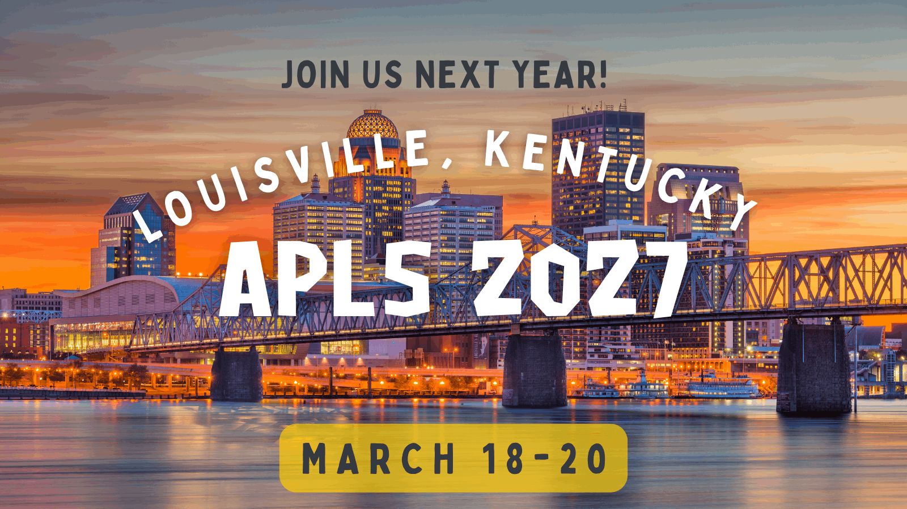
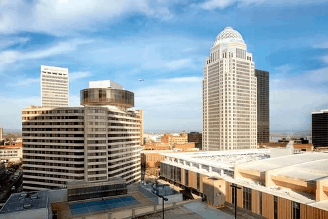

```{r setup, include=FALSE}
knitr::opts_chunk$set(echo = TRUE)
source("../assets/apls_functions.R")
```

:::::: column-screen
::::: hero-banner
:::: content-block
### 2027 Annual Conference of the American Psychology-Law Society

####  Louisville, KY

####  March 18-20, 2027

::::
:::::
::::::

::: {.column-screen}
::: grid
::: {.alt-background-blue}

```{r toc}
#| echo: false
#| warning: false
#| message: false

content <- rowwise_table(
  ~name, ~icon, ~link,
  "General", "info-circle", "#info",             
  "Registration", "person-add", "#registration",
  "Hotel", "airplane", "#hotel",
  "Program", "person-workspace", "#schedule",
  "Archives", "journal-text", "archive/index.qmd"
)

div(
  class = "bg-light",
  div(
    class = "bg-breakout",
    div(
      class = "inner-container",
      div(
        class = "boxed-wrapper",
        div(
          class = "boxed-feature-grid",
          pmap(content, \(name, icon, link) {
            div(
              class = "boxed-feature-grid__item",
              div(
                class = "boxed-feature-grid__icon",
                a(
                  href = link, 
                  class = "boxed-feature-grid__link",
                  tags$i(class = str_c("bi-", icon, " boxed-feature-grid__i"))
                )
              ),
              div(class = "boxed-feature-grid__title", name)
            )
          })
        )
      )
    )
  )
)
```
:::
:::
:::

::: vspace
:::

# General Information {#info}

<figure class="text-end">

<blockquote class="blockquote">

<p class="mb-0">

If you have any questions or comments about the conference, please contact the conference co-chairs at [conference\@ap-ls.org](mailto:conference@ap-ls.org) <br>

Looking forward to seeing everyone in March!

<figcaption class="blockquote-footer">

2027 AP-LS Conference Co-Chairs 

</figcaption>

</figure>

::: {.panel-tabset .box-shadow}

##  Welcome!



:::

::: vspace
:::

<hr>

::: vspace
:::


::::: column-screen
:::: {.simple-info-blue .alt-background-blue}
::: content-block-blue
##### Want to learn more about the [AP-LS Annual Conference]{.highlight}?

[Learn More ](archive/index.qmd){.btn-action .btn .btn-secondary .btn-lg role="button"}
:::
::::
:::::

::: vspace
:::

# Submissions {#proposals}

::: vspace
:::

::: {.panel-tabset .box-shadow}

##  Call for proposals

::: vspace
:::

::: simple-info-center

#### More information available Fall 2026!

:::

:::

::: vspace
:::

<hr>

::: vspace
:::

# Hotel Information {#hotel}

::: vspace
:::

::: {.panel-tabset .box-shadow}

##  Marriott Louisville Downtown

::: vspace
:::

{fig-align="center" fig-alt="Exterior photograph of the Marriott Louisville Downtown hotel building in Louisville, Kentucky"}

::: vspace
:::

##### The 2027 AP-LS Conference will be held at the [Louisville Marriott Downtown](https://www.gotolouisville.com/directory/louisville-marriott-downtown/)

**Location:** 280 W Jefferson St, Louisville, KY 40202

::: vspace
:::

::: {.callout-important}
## AP-LS Room Block!

The 2027 room block is now available!! People can book directly through the hotel to receive the discounted rate.

[Book Room ](https://book.passkey.com/go/APLSMAR2027){.btn-action .btn .btn-secondary .btn-lg role="button"}
:::

:::


::: vspace
:::

<hr>

::: vspace
:::

# Schedule {#schedule}

::: vspace
:::

::: {.panel-tabset .box-shadow}

##  Info

::: vspace
:::


::: simple-info-center

#### More information available Fall 2026!

:::

:::

::: vspace
:::

<hr>

::: vspace
:::

# Registration {#registration}

::: {.panel-tabset .box-shadow}

##  Info


::: simple-info-center

#### Online registration available in early 2027!
:::

::: vspace
:::

##  Pricing

::: vspace
:::

::: {.callout-note appearance="simple"}
## REGISTRATION RATES & INCLUSIONS

*Rates based on 2026 and may be subject to change

+-----------------------+-----------------+--------------+
| Status                | Early Bird\     | Regular\     |
|                       | (before Jan 31) | (on Feb 1)   |
+:======================+:================+:=============+
| AP-LS Full Members    | $345            | $380         |
+-----------------------+-----------------+--------------+
| AP-LS ECP Members     | $240            | $270         |
+-----------------------+-----------------+--------------+
| Non Members           | $490            | $575         |
+-----------------------+-----------------+--------------+
| AP-LS Student Members | $90             | $125         |
+-----------------------+-----------------+--------------+
| Non Members Students  | $170            | $210         |
+-----------------------+-----------------+--------------+
:::

:::

::: vspace
:::

<hr>

::: vspace
:::

# Preconference Workshops {#preconference}

::: {.panel-tabset .box-shadow}

##  Info

##### [ Wednesday, March 17, 2027]{.highlight}

*Attendees will have the ability to register for the pre conference workshops with their conference registration.*


#### More information available Fall 2026!

::: vspace
:::

##  Pricing

::: {.callout-note appearance="simple"}
## REGISTRATION RATES & INCLUSIONS

*Rates based on 2026 and may be subject to change

### Full-Day Workshop Rates

+--------------------+-----------------+----------------+
| Status             | Early Bird\     | Regular\       |
|                    | (before Jan 31) | (on Feb 1)     |
+:===================+:================+:===============+
| Member             | \$200           | \$230          |
+--------------------+-----------------+----------------+
| Non-Member         | \$250           | \$280          |
+--------------------+-----------------+----------------+
| Student Member     | \$80            | \$100          |
+--------------------+-----------------+----------------+
| Student Non-member | \$100           | \$120          |
+--------------------+-----------------+----------------+

### Half-Day Workshop Rates

+--------------------+-----------------+----------------+
| Status             | Early Bird\     | Regular\       |
|                    | (before Jan 31) | (on Feb 1)     |
+:===================+:================+:===============+
| Member             | \$100           | \$115          |
+--------------------+-----------------+----------------+
| Non-Member         | \$125           | \$140          |
+--------------------+-----------------+----------------+
| Student Member     | \$40            | \$50           |
+--------------------+-----------------+----------------+
| Student Non-member | \$50            | \$60           |
+--------------------+-----------------+----------------+
:::

:::
