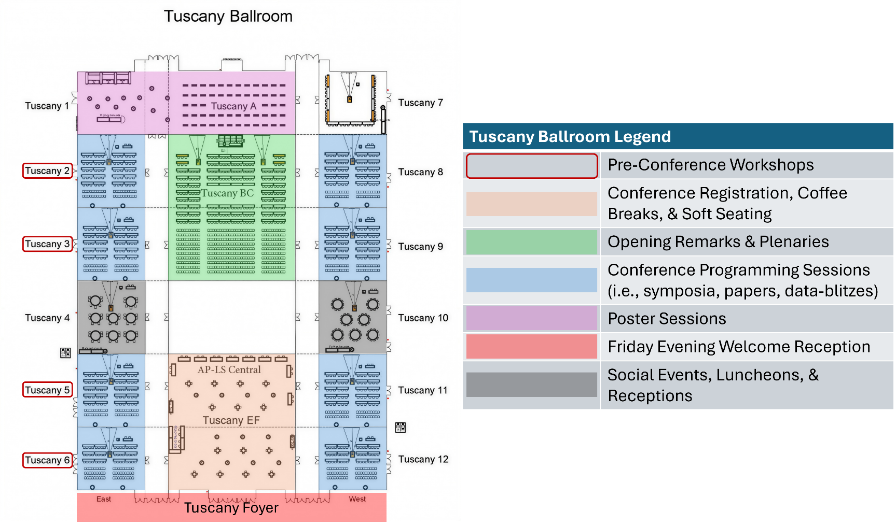
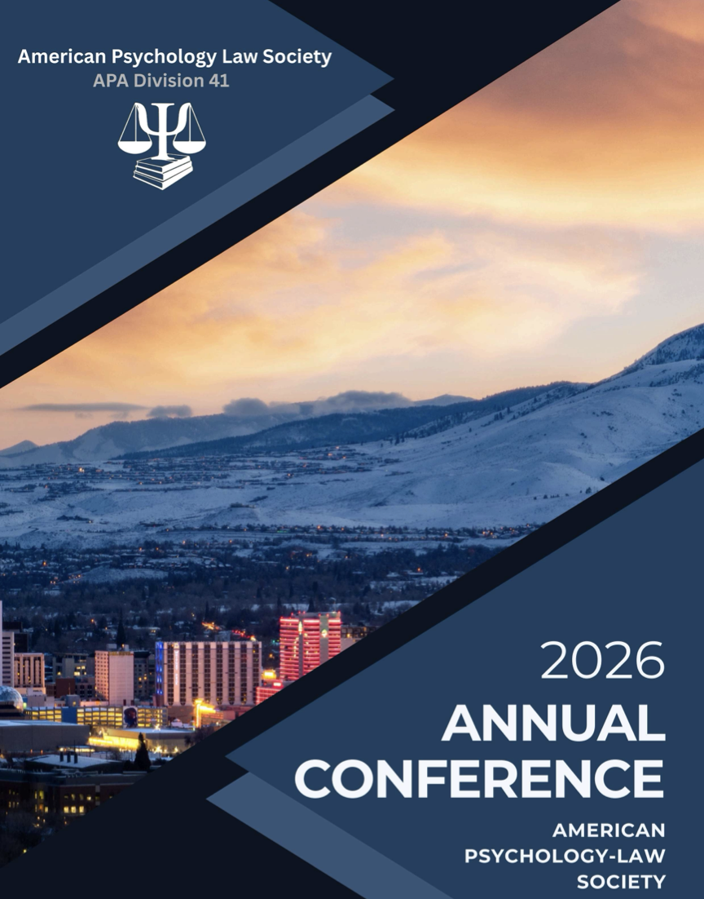
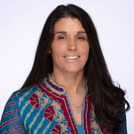
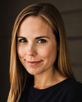
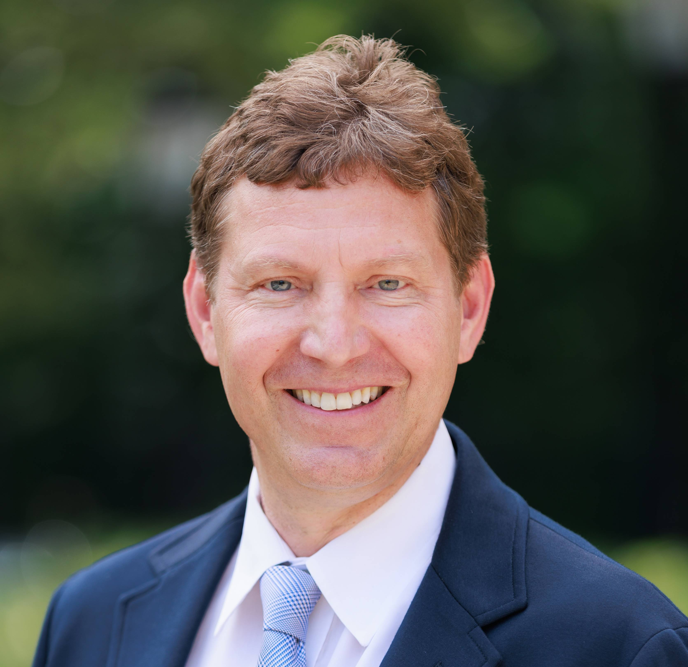
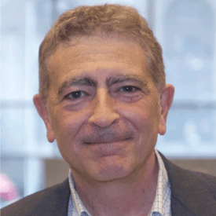
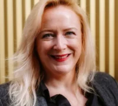
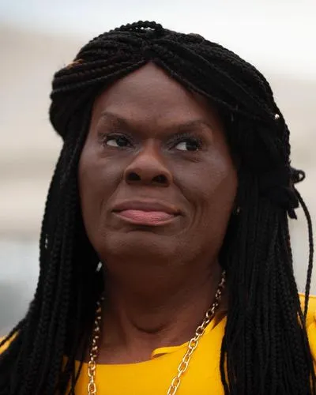
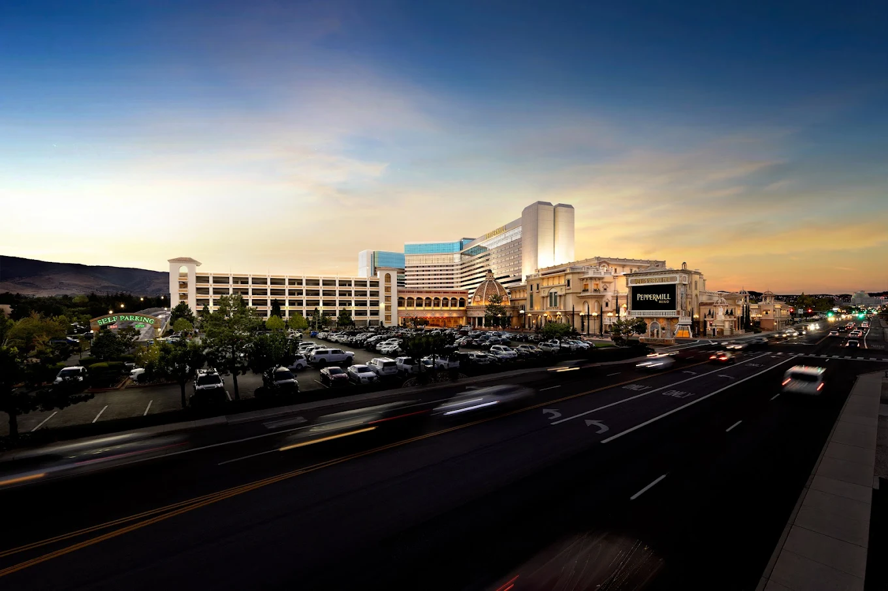
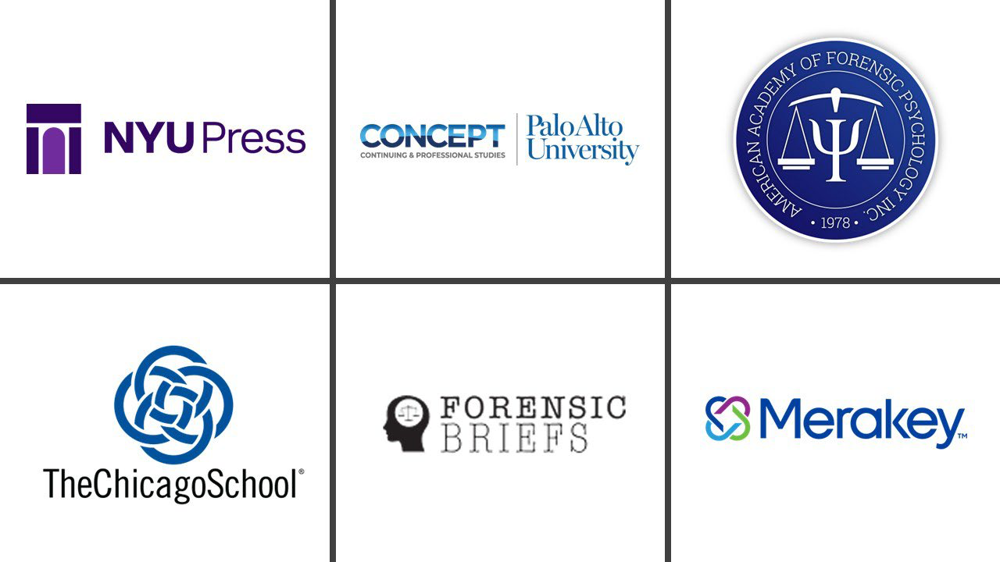

```{r setup, include=FALSE}
knitr::opts_chunk$set(echo = TRUE)
source("../assets/apls_functions.R")
```

:::::: column-screen
::::: hero-banner
:::: content-block
### 2026 Annual Conference of the American Psychology-Law Society

####  Reno, Nevada

####  March 12-14, 2026

::: hero-buttons
[Register](#registration){.button-17 .btn-guide role="button"} 
[Schedule](#schedule){.button-17 .btn-guide role="button"} 
:::
::::
:::::
::::::

::: column-screen
```{r toc}
#| echo: false
#| warning: false
#| message: false

content <- rowwise_table(
  ~name, ~icon, ~link,
  "General", "info-circle", "#info",             
  "Registration", "person-add", "#registration",
  "Hotel", "airplane", "#hotel",
  "Program", "person-workspace", "#schedule",
  "Archives", "journal-text", "archive/index.qmd"
)

div(
  class = "bg-light",
  div(
    class = "bg-breakout",
    div(
      class = "inner-container",
      div(
        class = "boxed-wrapper",
        div(
          class = "boxed-feature-grid",
          pmap(content, \(name, icon, link) {
            div(
              class = "boxed-feature-grid__item",
              div(
                class = "boxed-feature-grid__icon",
                a(
                  href = link, 
                  class = "boxed-feature-grid__link",
                  tags$i(class = str_c("bi-", icon, " boxed-feature-grid__i"))
                )
              ),
              div(class = "boxed-feature-grid__title", name)
            )
          })
        )
      )
    )
  )
)
```
:::

::: vspace
:::

# General Information {#info}

::: vspace
:::

<figure class="text-end">
<blockquote class="blockquote">
<p class="mb-0">

If you have any questions or comments about the conference, please contact the conference co-chairs at [conference\@ap-ls.org](mailto:conference@ap-ls.org)

<figcaption class="blockquote-footer">
2026 AP-LS Conference Co-Chairs <cite title="Luna Filipović, Ph.D. Cantab & Heath Hodges, Ph.D., M.L.S., ABPP">Luna Filipović, *Ph.D. Cantab* & Heath Hodges, *Ph.D., M.L.S., ABPP (Forensic)*</cite>
</figcaption>
</blockquote>
</figure>

::: vspace
:::

::: {.panel-tabset .box-shadow}
##  Welcome!

::: vspace
:::

::: inner-container

[Welcome from the Conference Co-Chairs!]{.event-space-title}

Welcome to Reno and the 2026 Annual Conference of the American Psychology-Law Society (AP-LS)! The AP-LS Annual Conference includes a variety of content over the course of three days. Programming content includes symposia, papers, data-blitzes, and poster sessions. In addition to this are plenaries, distinguished award addresses, Committee-sponsored events (e.g., luncheons, networking events) and special sessions (e.g., expert panels), and social receptions in the evenings. The AP-LS Annual Conference is a rich opportunity for career growth, knowledge enhancement, and professional networking. 

Each year, the AP-LS Annual Conference is curated by two co-chairs who have brought their own brand of management, style, and innovation. We are excited to announce several new features at this year's conference and within the Conference Program (this document). These include:

-   The Conference Program is substantially briefer than previous years, with an emphasis on increased convenience, organization, and readability.

-   Every item in this document's Table of Contents is hyperlinked. Clicking it will take the reader directly to that section. Click the header or subheader to be redirected to the top of the document. 

-   Rather than incorporating session abstracts into this document, we have hyperlinked this information to the 2026 AP-LS Book of Abstracts, which provides the titles, authors, author affiliations, and abstracts for every presentation at the conference. 

-   The opening of the conference has been revised to have more content (i.e., 2 Presidential Plenaries) while being less condensed (i.e., shorter talks, an in-between break). 

-   This year, special consideration was given to proposals regarding the use of Artificial Intelligence (AI) in psychology and law. While last year included only 5 AI-related presentations of any kind, this year's programming includes an AI Pre-Conference Workshop, an AI symposium, an AI Data-Blitz, 14 papers, and 8 posters related to the use of AI in psychology and law. These sessions are listed in the Programming Highlights subsection entitled "AI-Related Programming."

-   This year features an Exclusive Film Screening of an unreleased documentary (Sixteen Years) about a wrongfully convicted man. Following the screening is a discussion with the director, exoneree, and a panel of experts.

We hope you find this year's conference to be enjoyable, enlightening, and inspirational.

<figure class="text-end">
<figcaption class="blockquote-footer">
2026 AP-LS Conference Co-Chairs <cite title="Luna Filipović, Ph.D. Cantab & Heath Hodges, Ph.D., M.L.S., ABPP">Luna Filipović, *Ph.D. Cantab* & Heath Hodges, *Ph.D., M.L.S., ABPP (Forensic)*</cite>
</figcaption>
</figure>
:::

::: vspace
:::

##  Hotel & Registration

::: vspace
:::

### Hotel Information

:::: {layout-ncol="2"}
::: col
[Peppermill Resort Spa Casino](https://www.peppermillreno.com/){.event-info}<br> 
[2707 South Virginia Street<br>Reno, Nevada, USA, 89502]{.event-space-title}
:::

::: col

:::
::::

::: vspace
:::

### Registration Information

<center>
::: callout-note
## Registration location and badge pick-up times

[Conference Registration]{.event-space-title}<br> 
*Tuscany E/F*<br> 
[Wednesday 8:00 AM - 5:00 PM]{.event-time}<br> 
[Thursday 8:00 AM - 5:00 PM]{.event-time}<br> 
[Friday 8:00 AM - 5:00 PM]{.event-time}<br> 
[Saturday 8:00 AM - 5:00 PM]{.event-time}
:::


::: vspace
:::

### Welcome & Poster Receptions


[All are welcome to attend!]{.session-title}

[Welcome Reception]{.event-info}<br> 
[Thursday 6:30 - 8:30 PM]{.event-time}<br> 
[Tuscany Foyer]{.event-space-title}

::: vspace
:::

[Poster Receptions]{.event-info}<br> 
[Friday & Saturday 6:30 - 8:00 PM]{.event-time}<br> 
[Tuscany 1/A]{.event-space-title}

</center>

::: vspace
:::

##  Conference Program

::: vspace
:::

### Navigating the conference

We've made it easy for you to plan and navigate your conference experience:

-   **AP-LS Program Grid** - An abbreviated schedule of conference events that provides a quick overview of sessions, times, and locations.

-   **AP-LS Conference Program** - A comprehensive program of conference events that incorporates and expands upon the Program Grid with full session details.

-   **AP-LS Book of Abstracts** - An extensive catalogue of all conference sessions including titles, authors, affiliations, and complete abstracts for every presentation.

::: vspace
:::

<center>
[ Program Grid](https://drive.google.com/drive/folders/1a1nEX8-XLYYiYn-jOP_LOfPYuo9NJlbA){.btn .btn-outline-primary role="button"} [ Full Program](https://drive.google.com/drive/folders/117Xg_6N8Hy2mAC0XcUydqGwupzUHEzuq){.btn .btn-outline-primary role="button"} [ Book of Abstracts](https://drive.google.com/drive/folders/1SSUQ6a18Z8BqIu75UjcXKRYr97wxq86A){.btn .btn-outline-primary role="button"}
</center>

::: vspace
:::

### Mobile App Access

::: vspace
:::

#### Download the app before you arrive

Download the **Ex Ordo app** and use passphrase: `apls2026`

::: {layout-ncol="2"}
::: col 
The mobile app includes real-time schedule updates, session details, abstracts, networking tools, and conference maps.

[ Download App](https://builder.guidebook.com/g/#/guides/ap-ls2026/download-app){.btn .btn-outline-primary role="button"}
:::

::: col

:::
:::

::: vspace
:::

##  Internet & Social Media

::: vspace
:::

### Wireless Internet

**Network Name:** Peppermill_Guest  
**Password:** None required (Free access)

Wireless Internet should be easily accessible in the Tuscany Ballroom. Select the Free option to connect. No password is required.

::: vspace
:::

### Policy for Social Media Use

The AP-LS values open dialogue about the data and issues presented at the conference; however, we also value the rights and privacy of the conference participants. AP-LS encourages the use of social media (e.g., X, Facebook, Instagram, YouTube, SnapChat, blogs, etc.) during paper, poster, and plenary and social events, including live tweeting, with some limitations.

::: callout-important
**Please DO:**

- Follow AP-LS on social media (see below for accounts)
- Use the hashtag **#APLS2026** and other relevant hashtags
- Engage with other conference attendees
- Be respectful in the tone and content of your posts
- Silence all phones and tablets
- Consider sitting near the back if using a laptop or tablet

**Please DON'T:**

- Share photos or videos of attendees without their consent
- Share data without the author's consent
- Post about talks or posters where presenter uses the social media dropout symbol
:::

::: vspace
:::

**Presenters:** Presenters have the option of using the Social Media Dropout Symbol. If a presentation or poster includes this symbol, attendees should refrain from posting about the presentation on social media.

**Follow AP-LS on Social Media:**

- **Bluesky** – @apls.org
- **Facebook** – American Psychology-Law Society page
- **LinkedIn** – American Psychology-Law Society group
- **Instagram** – @apls41
- **YouTube** – American Psychology-Law Society
- Use the hashtag **#APLS2026** when posting about the conference!

::: vspace
:::

##  Community Standards & Health

::: vspace
:::

### Community Standards

The AP-LS Community Standards applies to all participants in AP-LS events, including AP-LS leadership (Executive Committee), attendees, speakers, staff, volunteers, exhibitors, vendors, guests, members of the media, and service providers. The AP-LS Community Standards apply to all AP-LS events, programs, meetings, activities, and social gatherings. These standards may also apply to unacceptable behavior that occurs at AP-LS-related events outside of or adjacent to official AP-LS activities, such as unofficial events (including social events and receptions) taking place during the AP-LS pre-conference or conference, when such behavior has the potential to create a hostile climate for participants during AP-LS activities. Participants must agree to abide by these Community Standards to continue membership in AP-LS and/or attend AP-LS events. This policy is intended to complement, and does not supersede, the APA Code of Ethics.

**If you experience or witness concerning behavior:**

- **Confidential discussion:** Contact the AP-LS Ombuds at ombuds@ap-ls.org
- **Immediate response needed:** Contact a designated responder. Designated responders are members of the AP-LS Executive Committee and AP-LS staff. These individuals will have identifiers during the conference. You can also approach staff at the registration desk who will connect you with a designated responder immediately.
- **Formal complaint:** You always have the option of filing a formal complaint (please refer to the Community Standards for more information about this process).

::: vspace
:::

### Illness Precautions

::: callout-important
Please be considerate of your colleagues and if you have symptoms of a contagious illness such as the flu or COVID, do not visit any conference spaces. We appreciate everyone working together so we all stay healthy!
:::

::: vspace
:::

##  For Session Presenters

::: vspace
:::

### Symposia, Paper, and Data Blitz Sessions

##### All conference sessions are located in the [Tuscany Ballroom]{.highlight}.

**Symposium sessions** are either 60 minutes (3 papers) or 80 minutes (4-6 papers) long, allowing 12 minutes for each presentation. Remaining time at the end of the session should be reserved for Discussant comments and questions from the audience. All symposia include a Discussant.

**Paper sessions** are either 60 minutes (3-4 papers) or 80 minutes (5-6 papers) long, allowing 12 minutes for each presentation. All paper sessions require one of the presenters to act as the "chair" for that session. We advise that the final presenter in each session should assume the role of chair. Chairs are responsible for explaining any presenter preferences, vetting questions from the audience, and managing the timeliness of the session.

**Data-Blitz sessions** are 60-minutes sessions, with no more than 10 data-blitzes per session (6 minutes per presentation). All data-blitz sessions are scheduled to occur in Tuscany 12. We advise that the final presenter in each session should assume the role of chair.

::: vspace
:::

::: callout-caution
## KEEP IN MIND

#####  **AV Equipment**

All rooms will be equipped with a PC laptop and standard AV adapters and connectors. Tech support will be provided by hotel staff, as needed.

**Presenters using PowerPoint or some other type of digital slideshow should download their presentations onto a USB flash drive and bring this with them to the session.** To ensure the security of content, we recommend accessing your slideshow directly from the USB flash drive rather than downloading it onto the device. While presenters should be able to access their materials through email, this tends to be more timely, less efficient, and less reliable method than a USB flash drive.

There are no requirements or limits on the number of PowerPoint slides per presentation. In general, 6-to-12 slides (one-to-two minutes per slide) are sufficient for a 12-minute presentation. Presenters are encouraged to practice their talks in advance to ensure that they can finish within the time allocated. Data-blitz presenters should aim for about 3 slides in their 6-minute session.

We recommend all presenters arrive 5-10 minutes early for their session to set up their slideshows, troubleshoot potential issues (e.g., technical difficulties), and coordinate session logistics (e.g., designating a session chair).

All sessions include excess time to account for unforeseen delays (e.g., technical difficulties), Discussant/Chair comments, and audience questions. The amount of excess time can vary across sessions depending on the nature of the session, number of presenters, and the duration of the session.

#####  **WIFI**

Wireless Internet (Peppermill_Guest) is available in all conference rooms.

#####  **Room Setup**

Rooms are easily accessible through connecting hallways. "Soft seating" is provided, with refreshments served at various intervals, throughout the conference.
:::

::: vspace
:::

##  For Poster Presenters

::: vspace
:::

### Poster Sessions

Poster sessions are scheduled from 6:30-8:00 PM on Friday and Saturday evenings. All posters are presented in **Tuscany 1/A**.

Presenters are scheduled for either Friday or Saturday night and will be given a number to correspond with the board where they should display their posters.

**Poster Sizing:** Poster boards are **4 ft (height) x 6 ft (width)**. Presenters are free to create any size poster that will fit within that space. Presenters will need to bring push pins to hang their posters; we do not provide push pins.

::: callout-tip
We encourage poster presenters to use the APA Convention Poster Instructions, including the use of the "Better Poster" format.
:::

::: vspace
:::

Posters are numbered to assist poster presenters in locating their respective poster boards, where they will display their posters. Posters are not organized by topic.

::: vspace
:::

##  Conference Organizers

::: vspace
:::

##### [Conference Contacts]{.highlight}

***Co-chairs***<br> 
Luna Filipović, Ph.D. Cantab &<br> 
Heath Hodges, Ph.D., M.L.S., ABPP (Forensic)<br> 
 conference\@ap-ls.org

:::

::: vspace
:::

# Program & Schedule {#schedule}

::: vspace
:::

::: {.panel-tabset .box-shadow}
##  Overview

::: vspace
:::
::: {layout-ncol="2"}
::: {.col .img-vcenter}

{width="277" fig-alt="Cover of the 2026 AP-LS Conference Program showing the conference branding"}
:::

::: col
### Plan your conference experience:

** Program Grid** - Quick reference schedule with session times and locations

** Conference Program** - Complete program with detailed session information and speaker bios

** Book of Abstracts** - Full abstracts for all presentations, including author details

** Mobile App** - Real-time updates and networking tools (passphrase: `apls2026`)

::: vspace
:::

<center>
[ Program Grid](https://drive.google.com/drive/folders/1a1nEX8-XLYYiYn-jOP_LOfPYuo9NJlbA){.btn .btn-sm .btn-outline-primary role="button"} [ Full Program](https://drive.google.com/drive/folders/117Xg_6N8Hy2mAC0XcUydqGwupzUHEzuq){.btn .btn-sm .btn-outline-primary role="button"} [ Abstracts](https://drive.google.com/drive/folders/1SSUQ6a18Z8BqIu75UjcXKRYr97wxq86A){.btn .btn-sm .btn-outline-primary role="button"} [ App](https://builder.guidebook.com/g/#/guides/ap-ls2026/download-app){.btn .btn-sm .btn-outline-primary role="button"}
</center>

::: vspace
:::
:::
:::

::: vspace
:::

## Pre-Conference (Wed) {#preconf}

::: vspace
:::

::: vspace
:::

##### [ Wednesday, March 11, 2026]{.highlight}

::: vspace
:::

[Attendees will have the ability to register for the pre conference workshops with their conference registration.]{.event-space-title}


::: vspace
:::

[Learn More ](preconference/index.qmd){.btn .btn-outline-primary .ml-auto role="button"}

::: vspace
:::

## Day 1 (Thurs) {#day1}

::: vspace
:::


##### [ Thursday, March 12, 2026]{.highlight}


[Day 1 Highlights]{.event-space-title}

::: vspace
:::

[Opening Ceremony & Award Announcements]{.plenary}

[ Tuscany B/C]{.session-loc}

[ 12:30 PM - 1:00 PM]{.session-time}

::: session-description
Join us for the official opening of the 2026 AP-LS Annual Conference. The AP-LS President will provide opening remarks and announce this year's award winners, including the Distinguished Contributions to Psychology and Law Award, Saleem Shah Awards for Early Career Excellence, and AP-LS Mid-Career Award.
:::

::: vspace
:::

[Presidential Plenary #1]{.plenary}

[ Tuscany B/C]{.session-loc}

[The Truth about Lying: Children's Lies, Truths and Testimony]{.session-title}

[ 1:00 PM - 2:00 PM]{.session-time}

::: session-description
Honesty is a virtue highly valued in our society. It is viewed as a moral obligation, encouraged by parents and educators and required by clinicians, social workers, and legal professionals. For the courts, the veracity of child witness testimony is central to the justice system where there are serious consequences for the child, the accused, and society. Dr. Victoria Talwar will discuss research examining children's developing lie-telling abilities and the cognitive, social and motivational factors that influence their behavior. She will also discuss the influence of coaching on children's reports and factors that influence their truthful disclosures. She will discuss the implications for child witness testimony and professionals who wish to ensure the veracity of children's reports.
:::

::: inner-container
{.avatar fig-alt="Portrait photograph of Dr. Victoria Talwar, Professor at McGill University"}

[Speaker: Dr. Victoria Talwar, McGill University]{.session-chair}

::: session-bio
*Dr. Victoria Talwar is a Professor in the Department of Educational and Counselling Psychology at McGill University where she is the William Dawson Scholar and holds a Tier I Canada Research Chair in Forensic Developmental Psychology. Her research examines children's lie-telling and truth-telling behaviors and their implications for child witness testimony. She is a Fellow of the American Psychological Association and the Association for Psychological Science.*
:::
:::

::: vspace
:::

[Presidential Plenary #2]{.plenary}

[ Tuscany B/C]{.session-loc}

[Who are the Game Changers? Why We Need to Study Leadership in Adolescence]{.session-title}

[ 2:30 PM - 3:30 PM]{.session-time}

::: session-description
Although leadership research has flourished in recent decades, empirical investigations and theoretical advances have focused almost entirely on adults. The lack of focus on leadership in adolescence reflects a substantial gap, because leadership is a process that begins developing early in life. Many stakeholders are highly invested in understanding, predicting, and enhancing leadership abilities early in life. Furthermore, focusing on developmental pathways would extend theories of leadership, especially those pertaining to antecedents of major adult leadership constructs. This talk will outline a potential framework for the empirical study of adolescent leadership that integrates cutting-edge knowledge from the leadership literature with critical insights from developmental science and informs both theory and practice.
:::

::: inner-container
{.avatar fig-alt="Portrait photograph of Dr. Jennifer L. Tackett, Boeschenstein Professor at Northwestern University"}

[Speaker: Dr. Jennifer L. Tackett, Northwestern University]{.session-chair}

::: session-bio
*Dr. Jennifer Tackett is the Boeschenstein Professor of Psychology at Northwestern University. Her research focuses on developmental psychopathology, with emphasis on child and adolescent personality and temperament. She is a Fellow of the Association for Psychological Science and serves on multiple editorial boards. Her work on adolescent leadership has important implications for early intervention and antisocial youth.*
:::
:::

::: vspace
:::

[AP-LS Presidential Address]{.plenary}

[ Tuscany 2]{.session-loc}

[Future Directions for Conduct Disorder and Psychopathic Trait Specifiers]{.session-title}

[ 5:00 PM - 6:00 PM]{.session-time}

::: session-description
This presentation will focus on conduct disorder (CD) in children and adolescents and how affiliated personality traits may help inform etiology and treatment of CD. The presentation first centers on a description of CD and its historical context. Second, the presentation focuses on the novel Proposed Specifiers for Conduct Disorder (PSCD) scale and its factor structure and psychometric properties. Third, the presentation centers on how children and adolescents with CD may look differently based on personality perturbations. Fourth, the presentation addresses how personality characteristics may inform differential diagnosis (e.g., ADHD). Fifth, the potential etiological mechanisms for CD are briefly discussed as well as what implications identifying mechanisms may have for innovating treatment. The Proposed Specifiers for Conduct Disorder (PSCD) has been gaining considerable empirical support (Bellamy et al., 2024). Across multiple studies the four-factor structure has been replicated, and this structure has been replicated across a variety of cultures and settings (e.g., community, forensic). The PSCD also has been shown to have good convergent and discriminant validity and has been shown to have meaningful relationships with theoretically relevant constructs which has further helped to inform its nomological network. In addition, the PSCD has been shown to be related to conduct problems, aggression, substance use problems, and other relevant criterion-based variables related to health.
:::

::: inner-container
{.avatar fig-alt="Portrait photograph of Dr. Randy Salekin"}

[Speaker: Randy Salekin, Ph.D., AP-LS President]{.session-chair}
:::

::: vspace
:::

[Special Session]{.plenary}

[ Tuscany 5]{.session-loc}

[The Psychology of False Confessions: My Fifty-Year Journey]{.session-title}

[ 5:00 PM - 6:00 PM]{.session-time}

::: session-description
Please join friends and colleagues to celebrate Dr. Saul Kassin's career, professional accomplishments, and research in the domain of false confessions over the past 50 years!
:::

::: inner-container
{.avatar fig-alt="Portrait photograph of Dr. Saul Kassin"}

[Speaker: Saul Kassin]{.session-chair}
:::

::: vspace
:::

## Day 2 (Fri) {#day2}

::: vspace
:::

##### [ Friday, March 13, 2026]{.highlight}

::: vspace
:::


[Day 2 Highlights]{.event-space-title}

[Friday Plenary]{.plenary}

[ Tuscany B/C]{.session-loc}

[High Stakes, Hidden Meanings: Culture, Memory, and Context in Investigative Interviewing]{.session-title}

[ 10:45 AM - 12:15 PM]{.session-time}

::: session-description
Investigative interviewing is often framed as a technical exercise in extracting accurate accounts in law enforcement contexts. This plenary explores how cultural assumptions shape what is asked, what is remembered, and what is ultimately understood in investigative and forensic interviews. Drawing on interdisciplinary research spanning psychology, law, and cross-cultural communication, the session examines how seemingly objective interview practices can carry hidden cultural expectations that influence disclosure and interpretation. A central focus will be the challenges that arise in cross-cultural interviews when assumptions about memory reporting do not align. The session will introduce context-sensitive principles for culturally responsive information gathering and discuss practical strategies to mitigate cultural mismatch and enhance both fairness and evidential quality in investigative practice.
:::

::: inner-container
{.avatar fig-alt="Portrait photograph of Dr. Lorraine Hope, Professor at University of Portsmouth"}

[Speaker: Dr. Lorraine Hope, University of Portsmouth]{.session-chair}

::: session-bio
*Dr. Lorraine Hope is Professor of Applied Cognitive Psychology at the University of Portsmouth. Her research focuses on eyewitness memory, investigative interviewing, and intelligence gathering. She is particularly known for her work on the Self-Administered Interview and cross-cultural aspects of memory reporting. She has extensive experience working with law enforcement and legal practitioners internationally.*
:::
:::

::: vspace
:::

## Day 3 (Sat) {#day3}

::: vspace
:::

##### [ Saturday, March 14, 2026]{.highlight}

[Day 3 Highlights]{.event-space-title}

::: vspace
:::

[Saturday Plenary]{.plenary}

[ Tuscany B/C]{.session-loc}

[When It Counts: Psychological Ethics in a Security-Driven Prison System]{.session-title}

[ 10:45 AM - 12:15 PM]{.session-time}

::: session-description
This plenary features a first-hand account from Dee Farmer, the petitioner in *Farmer v. Brennan* (1994), the landmark U.S. Supreme Court case that reshaped Eighth Amendment protections for incarcerated individuals. She will discuss her decades-long incarceration in the federal prison system and reveal how she navigated trauma, gender dysphoria, medical care needs, segregation, sexual violence, and the weaponization of psychological practice—all while fighting for survival and justice. She will explain how psychologists were repeatedly involved in unethical policies and inhumane practices, but also share the transformative power of ethical and compassionate psychological care. She will examine uncomfortable truths about the role of psychological practice in institutional violence and offer recommendations to current and upcoming clinicians who wish to serve individuals in correctional settings.
:::

::: inner-container
{.avatar fig-alt="Portrait photograph of Dee Farmer, author and prison reform advocate"}

[Speaker: Dee Farmer]{.session-chair}

::: session-bio
*Dee Farmer is an author, advocate, and the petitioner in the landmark Supreme Court case Farmer v. Brennan (1994). Her case established the "deliberate indifference" standard for Eighth Amendment violations in prisons. Since her release, she has been a powerful voice for prison reform, transgender rights, and ethical treatment of incarcerated individuals.*
:::
:::

::: vspace
:::

[Special Film Screening & Panel Discussion]{.plenary}

[ Tuscany 6]{.session-loc}

[Sixteen Years: Documentary Screening and Expert Panel]{.session-title}

[ 1:30 PM - 4:00 PM]{.session-time}

::: session-description
Join us for a special, private screening of *Sixteen Years*, an unreleased documentary about Jeffrey Deskovic's fight for freedom after wrongful conviction. The film (92 minutes) sheds light on the shortcomings of the American justice system and is a testament to the human spirit. Following a brief break, participate in a Q&A session with Jeffrey Deskovic, filmmaker Jia Rizvi, and an expert panel including Jennifer Perillo, Lindsay Maloy, and Luna Filipović.
:::

::: inner-container
**Panelists:** Jeffrey Deskovic, Jia Rizvi, Jennifer Perillo, Lindsay Maloy, and Luna Filipović
:::

::: vspace
:::

:::

::: vspace
:::

<hr>

::: vspace
:::


# Registration {#registration}

::: vspace
:::

::: {.panel-tabset .box-shadow}
##  Info

::: vspace
:::

####  Online registration is open on December 1st!

::: vspace
:::

[*If you have any issues registering, please email <br>  *]{.session-chair}

::: vspace
:::

[Click Here ](https://apls.memberclicks.net/apls2026conference#){.btn .btn-outline-primary .ml-auto role="button"}

::: vspace
:::

##  Pricing

::: vspace
:::

::: {.callout-note appearance="simple"}
## REGISTRATION RATES & INCLUSIONS

+-----------------------+-----------------+--------------+
| Status                | Early Bird\     | Regular\     |
|                       | (before Jan 31) | (on Feb 1)   |
+:======================+:================+:=============+
| AP-LS Full Members    | $345            | $380         |
+-----------------------+-----------------+--------------+
| AP-LS ECP Members     | $240            | $270         |
+-----------------------+-----------------+--------------+
| Non Members           | $490            | $575         |
+-----------------------+-----------------+--------------+
| AP-LS Student Members | $90             | $125         |
+-----------------------+-----------------+--------------+
| Non Members Students  | $170            | $210         |
+-----------------------+-----------------+--------------+
:::

:::

::: vspace
:::

<hr> 

::: vspace
:::

# Hotel Information {#hotel}

::: vspace
:::

::: {.panel-tabset .box-shadow}
##  Peppermill Resort Spa Casino

::: vspace
:::

{fig-align="center" fig-alt="Exterior photograph of the Peppermill Resort Spa Casino hotel building in Reno, Nevada"}

::: vspace
:::

##### The 2026 AP-LS Conference will be held at the [Peppermill Resort Spa Casino](https://www.peppermillreno.com/)

**Location:** 2707 South Virginia Street, Reno, Nevada 89502

::: vspace
:::

***Parking Information***<br> 
 Complimentary self-parking and valet parking available

::: vspace
:::

 ***Airport Transportation***<br> 
Reno-Tahoe International Airport (RNO) is approximately 15 minutes from the hotel. Taxi, rideshare (Uber/Lyft), and rental car options are available. The hotel does not offer airport shuttle service.

::: vspace
:::

::: callout-important
## Room Block Status

The 2026 room block is now closed!! People can still book directly through the [hotel at this link](https://www.peppermillreno.com/).
:::

::: vspace
:::

::: hero-buttons
[ Hotel Website](https://www.peppermillreno.com/){.btn-action .btn .btn-dark .ml-auto role="button"}
[ Get Directions](https://goo.gl/maps/PeppermillReno){.btn .btn-outline-primary role="button"}
:::

:::

::: vspace
:::

<hr>

::: vspace
:::


::: vspace
:::

::::: column-screen
:::: {.simple-info-blue .alt-background-blue}
::: content-block-blue

::: vspace
:::

##### Want to learn more about the [AP-LS Annual Conference]{.highlight}?

[Learn More ](archive/index.qmd){.btn-action .btn .btn-secondary .btn-lg role="button"}

:::
::::
:::::

::: vspace
:::

::: vspace
:::

{fig-alt="Collection of sponsor and exhibitor logos for the 2026 AP-LS Conference"}